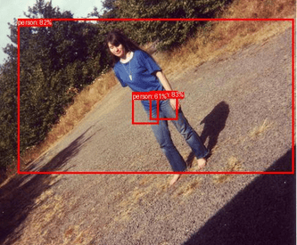
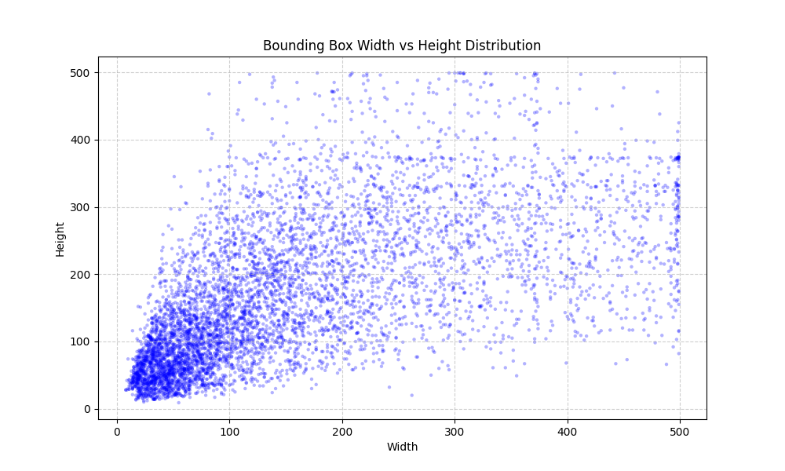
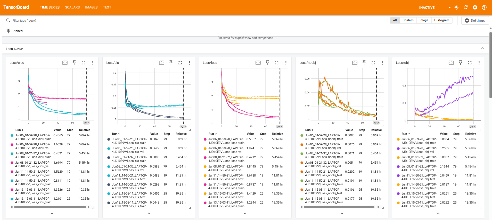
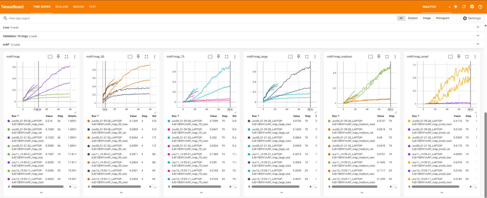
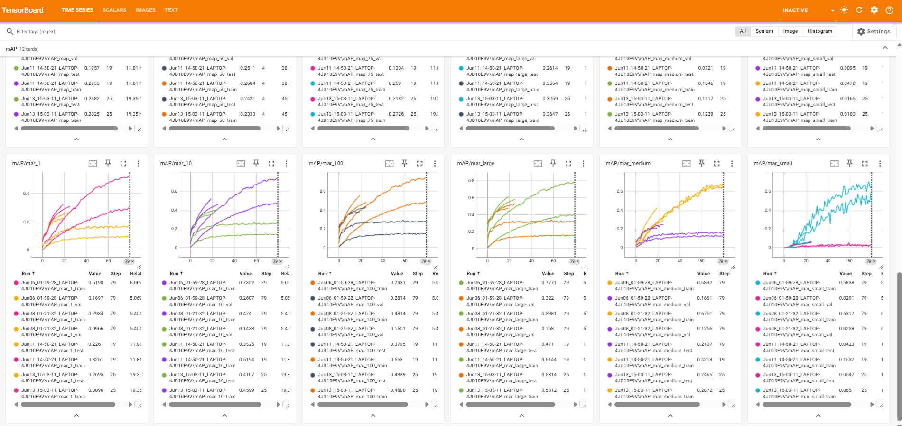

# YOLO (Customized YOLO-Style Object Detector)

> Four months of building and debugging a YOLO-inspired object detector from scratch in PyTorch.

<p align="center">
  
</p>

A custom object detection framework built to understand the inner workings of modern detectors, including anchor boxes, CIoU loss, experiment tracking, evaluation, and deployment.

---

## Motivation

Before working on object detection, I implemented a simple image classifier from scratch in my [Cat vs Dog Detector](https://github.com/MaherovskyiDenys/cat-vs-dog-detector).

The next goal was to move from single-object classification to multi-object detection. Rather than using an existing framework, I wanted to understand the mechanics behind YOLO by implementing the different components myself.

Over this time, I explored:

* Grid-based detection
* Multi-part loss functions
* Anchor boxes
* Bounding box regression
* Mean Average Precision (mAP)
* Tensor operations and indexing
* Experiment tracking and visualization
* Model deployment with FastAPI and Docker

This repository represents the result of that learning process.

---

## Architecture

The model is inspired by YOLOv1 with several modifications and improvements.

### Backbone

* ResNet18 pretrained on ImageNet-1K weights
* Additional down sampling layer
* Fully convolutional design
* Removal of the original fully connected layers

### Bounding Box Regression

Instead of the MSE loss used in YOLOv1, this implementation uses Complete IoU (CIoU) loss for localization.

### Classification

Class probabilities are optimized using:

* `BCEWithLogitsLoss`

### Input Resolution

* Input size: **448 × 448**
* Down sampling factor: **32**
* Grid size: **14 × 14**

### Data Augmentation

Data augmentation techniques are based on those described in the YOLOv2 paper.

---

## Dataset

### Initial Setup

Training:

* Pascal VOC 2007 Train

Validation:

* Pascal VOC 2007 Validation

### Final Setup

Training:

* Pascal VOC 2007 Train + Validation
* Pascal VOC 2012 Train + Validation

Testing:

* Pascal VOC 2007 Test

---

## Dataset Analysis

Before introducing anchor boxes, I analyzed the distribution of object dimensions in the Pascal VOC dataset.

### Bounding Box Width vs Height Distribution

<p align="center">
  
</p>

Scatter plot showing the relationship between ground truth bounding box widths and heights.

The distribution illustrates the diversity of object scales and aspect ratios present in the dataset and helped guide anchor box selection and it reveals that many objects in Pascal VOC are relatively small. Since the model reduces the input resolution by a factor of 32, much of the fine-grained information needed to detect these objects is lost. This limitation motivates future improvements involving multi-scale feature extraction and feature pyramid networks.

---

## Features

* Custom YOLO-style architecture
* Anchor box implementation
* Fully convolutional design
* CIoU loss for box regression
* BCEWithLogitsLoss for classification
* TensorBoard integration
* Training checkpoints
* Resume training capability
* Automatic best model saving based on mAP
* Prediction visualization utilities
* Evaluation using TorchMetrics
* FastAPI REST API
* Docker containerization
* Configurable training pipeline

---

## How to Train the Model

The project uses the Pascal VOC datasets.

To download the datasets, enable downloading inside `src/dataset/dataset.py` by changing:

```python
download=False
```

to

```python
download=True
```

for both:

- Pascal VOC 2007
- Pascal VOC 2012

Start training by running:

```bash
python -m src.training.main
```

During training:

- TensorBoard logs are written to `runs/`
- Checkpoints are automatically saved to `models/`
- The best model is selected based on mAP and stored in the `models/` directory
- Training can be resumed from saved checkpoints

---

## Training Progress

<p align="center">
  
</p>

One of the most useful debugging tools during development turned out to be visualization. Inspecting predicted bounding boxes helped identify problems that metrics alone could not reveal.

If you're interested in exploring the complete training history, TensorBoard logs are available for download.

Runs can be downloaded [here](https://drive.google.com/drive/folders/1JSPifxNunoMI6wPXbG5ENFir53Iy1Jra?usp=sharing).

Download the `runs/` directory and launch TensorBoard:

```bash
tensorboard --logdir runs
```

Then access at: `http://localhost:6006/`

---

## Results

After training on the combined Pascal VOC 2007 + 2012 datasets, the model achieved the following performance on the VOC 2007 Test set:

| Metric | Value                          |
| :--- |:-------------------------------|
| **mAP@0.5** | ~0.50                          |
| **Backbone** | ResNet18 (Pretrained)          |
| **Loss Function** | CIoU + BCEWithLogitsLoss + MSE |

### TensorBoard Monitoring

Training metrics are tracked using TensorBoard.

Examples include:

* Total loss
* Localization loss
* Object confidence loss
* Classification loss
* Validation metrics
* Mean Average Precision (mAP)

<p align="center">
  
</p>

<p align="center">
  
</p>

<p align="center">
  
</p>

Mean Average Precision (mAP) is used as the primary metric for evaluating model performance.

---

## Inference

Pretrained weights can be downloaded [here](https://drive.google.com/drive/folders/1JSPifxNunoMI6wPXbG5ENFir53Iy1Jra?usp=sharing).

Download the `models/` directory and place it inside the project root.

After that, build and run the Docker container:

```bash
docker build -t yolores .
docker run -p 8000:8000 yolores
```

Once the container is running, open: `http://localhost:8000/docs`

FastAPI will provide an interactive interface where you can access the `/predict` endpoint and upload an image.

The API returns:

* Predicted bounding boxes in (XYXY) format
* Class labels
* Confidence scores (0.0-1.0)

---


## Tools and Libraries

* PyTorch
* TorchVision
* TorchMetrics
* TensorBoard
* FastAPI
* Docker
* NumPy
* Matplotlib

---

## Project Structure

```text
api/
├── routes - REST API endpoints
├── services - Model inference
└── main.py - FastAPI app

configs/
├── config.py - Global variables such as image_size, grid size etc.
└── training.py - Hyperparameters config

data/
└── raw
    └── VOCdevkit/ - Datasets folder

models/ - Saved models

runs/ - TensorBoard folder to save runs

src/
├── dataset/
│   ├── dataloader.py - Creates dataloaders
│   ├── dataset.py - Loads datasets and encodes them to YOLO format
│   ├── transforms.py - Set data augmentation
│   └── visualization.py - Helper function to visualize width vs height distribution in dataset
│
├── inference/
│   └── predict.py - Inference model
│   
├── models/
│   └── model.py - Model architecture itself
│
├── schema/ - Schemas used for consistent output after each epoch
│   ├── epoch.py
│   └── loss.py
│   
├── training/
│   ├── decoder.py - Translates predicted output to torchmetrics format
│   ├── epoch.py - Script to run single epoch
│   ├── loss.py - Custom Loss
│   ├── main.py - Training pipeline
│   ├── optimizer.py - Creates optimizer (AdamW)
│   └── scheduler.py - Creates scheduler
│   
└── utils/
    ├── anchors.py - Operations with anchors (extracting/saving etc.)
    ├── backbone.py - Operations with backbone (freeze/unfreeze)
    ├── checkpoint.py - Checkpoints system
    ├── logger.py - Tensorboard logger
    ├── metrics.py - Keeps track of metrics/losses
    ├── paths.py - Module to define paths
    └── visualization.py - Decodes images for Tensorboard. Visualizes them
    
requirements.txt
Dockerfile
```

---

## Lessons Learned

This project significantly improved my understanding of:

* Object detection algorithms
* Anchor boxes
* Loss functions
* CIoU
* Tensor operations and indexing
* Experiment tracking
* Model evaluation
* Checkpointing
* FastAPI
* Docker
* Git and version control
* Deep learning project organization

One of the biggest lessons learned was that visualization and debugging are just as important as model architecture. Metrics provide useful information, but being able to inspect predictions visually often reveals problems that would otherwise go unnoticed.

---

## Future Improvements

Possible future directions include:

* Feature Pyramid Networks (FPN) for multiscale feature extraction.
* Detection heads operating at multiple resolutions.
* Mixed precision training
* Hyperparameter tuning
* Stronger backbone networks
* Additional datasets
* ONNX export
* Quantization
* Instance segmentation
* Transformer-based architectures

---

## References

### Papers

* [YOLOv1](https://arxiv.org/abs/1506.02640)
* [YOLOv2](https://arxiv.org/abs/1612.08242)
* [YOLOv3](https://arxiv.org/abs/1804.02767)

### Documentation

* PyTorch
* TorchVision
* TorchMetrics
* TensorBoard
* FastAPI

### Useful Resources

* https://www.youtube.com/watch?v=EItlUEPCIzM
* https://medium.com/@abhishekjainindore24/anchor-boxes-in-object-detection-1a7831e7cadf
* https://stackoverflow.com/questions/12943819/how-to-prettyprint-a-json-file
* https://stackoverflow.com/questions/32908639/open-pil-image-from-byte-file

---

## License

[MIT License](LICENSE.md)

---

# Author

Denys Maherovskyi

[LinkedIn](https://www.linkedin.com/in/denys-maherovskyi-b59004398/) | [GitHub](https://github.com/MaherovskyiDenys)